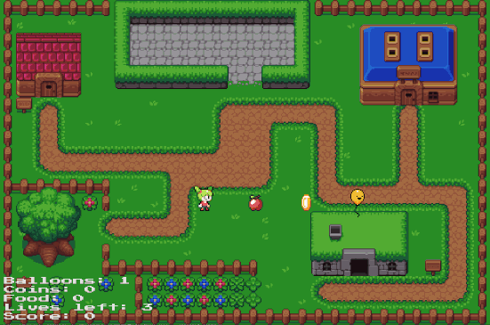

# Gaming-Simulation
## Physics Engine
 - physics simulation
 - collision detection
 
 
## AI 
 - state machine
 - path finding
 
## Game Logic
 - Map and Character Texture
 - Timing
 - collision resolution
 - game settings etc
